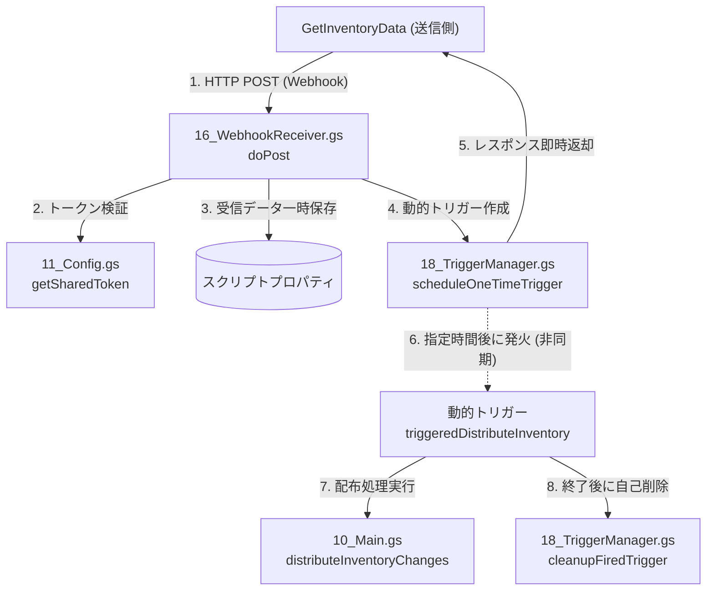
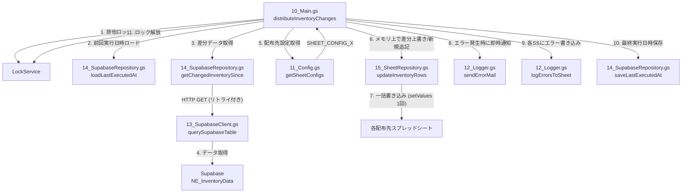
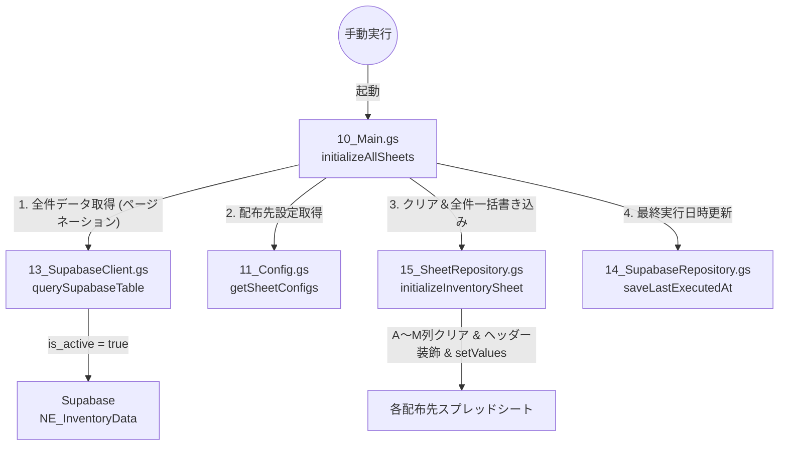

# 在庫情報配布システム (DistributeInventory)

Supabase の `NE_InventoryData` テーブルに蓄積された在庫情報のうち、**有効な商品（`is_active = true`）の差分**を抽出し、指定された複数の社内確認用スプレッドシートに対して、商品コードで紐付けた「上書き更新（存在しない場合は末尾追記）」を行う Google Apps Script (GAS) プロジェクトです。

> [!NOTE]
> ネクストエンジン側で削除・非表示となり、Supabase 側で非活性化（`is_active = false`）された商品は同期対象外となります。すでにスプレッドシートに同期済みの商品を消去したい場合は、手動で `initializeAllSheets`（全件初期化）を実行することで、有効な商品のみに再構成されます。

---

## 1. 全体構成とアーキテクチャ

本システムは、送信側（`GetInventoryData`）から Webhook（Web App）を受信したのち、動的ワンタイムトリガーを用いて非同期で在庫配布処理を起動します。配布処理は、Supabase から有効な商品の差分を抽出し、複数の配布先スプレッドシートに対してメモリ上で一括マージ・上書き更新を行います。

### A. Webhook受信＆非同期処理フロー (`doPost` ➔ `triggeredDistributeInventory`)
送信側からの Webhook を受信すると、即座に動的ワンタイムトリガーを作成してレスポンスを返却し、GASの実行時間制限（30秒）を回避しながら「実行数」パネルに完全なログを記録する構成となっています。



### B. 在庫差分配布フロー (`distributeInventoryChanges`)
前回の同期以降に Supabase 上で更新されたレコード（有効な商品のみ）を取得し、配布先スプレッドシートへ上書き、または新規追記します。



### C. 全件初期化フロー (`initializeAllSheets`)
スプレッドシートの新規導入時や、非アクティブ商品の同期リセット時に、Supabase から有効な全データを取得し、シートをクリアして書き直します。



---

#### テキスト形式での処理フロー

Mermaidダイアグラムが正しく表示されない環境（ローカルプレビュー等）の場合は、以下のテキストフローをご参照ください。

```
■ 処理フローA. Webhook受信＆非同期処理 (リアルタイム連携)
1. 送信側からPOSTリクエストを受信 (16_WebhookReceiver.gs: doPost)
   │  ├── スクリプトプロパティ `LAST_RECEIVED_DATA` に生データを一時保存 (ログ解析用)
   │  ├── 共有トークン `API_SHARED_TOKEN` による簡易認証
   │  │    └── トークン不一致時は `result: 'unauthorized'` を返して即時遮断
   │  ├── 動的ワンタイムトリガーを設定 (18_TriggerManager.gs: scheduleOneTimeTrigger)
   │  │    └── 実行関数: `triggeredDistributeInventory`, 遅延時間: デフォルト 100ms
   │  └── 送信側へ即座に受付確認レスポンス (`result: 'success'`) を返却して終了
   │
2. 動的トリガーの発火 (16_WebhookReceiver.gs: triggeredDistributeInventory)
   │  ├── メイン差分配布処理 `distributeInventoryChanges` を起動 (非同期実行)
   │  └── [SRE] 処理の成否に関わらず、トリガー自己削除処理を実行 (18_TriggerManager.gs: cleanupFiredTrigger)

■ 処理フローB. 在庫差分配布処理
1. 実行開始 (10_Main.gs: distributeInventoryChanges)
   │  ├── [SRE] LockService による多重起動防止の排他ロックを試行 (最大5秒待機)
   │  ├── 前回実行日時 `SUPABASE_LAST_EXECUTED_AT` をロード (14_SupabaseRepository.gs: loadLastExecutedAt)
   │  │    └── 初回・未設定時は 2時間前 をフォールバック値として使用
   │  ├── Supabase から基準日時以降の差分データを取得 (14_SupabaseRepository.gs: getChangedInventorySince)
   │  │    ├── is_active = true（有効な商品）のみでフィルタリング
   │  │    └── [SRE] 差分が 0件 の場合は、スプレッドシートやプロパティの更新を行わずに早期リターン
   │  ├── スクリプトプロパティ `SHEET_CONFIG_1` から始まる配布先SS設定群を取得 (11_Config.gs: getSheetConfigs)
   │  │
   ├── 2. 配布先スプレッドシートへのループ書き込み処理
   │    ├── スプレッドシートを開き、指定されたシートオブジェクトを取得
   │    ├── メモリ上での差分更新処理 (15_SheetRepository.gs: updateInventoryRows)
   │    │    ├── 対象シートのデータ（A〜M列）を一括でメモリ上に読み込み (getValues)
   │    │    ├── 「商品コード -> メモリ行インデックス」の Map を構築
   │    │    ├── 差分データ配列をループし、Mapに存在するものはメモリ上で上書き、ないものは配列末尾へ新規追記
   │    │    └── メモリ上の最新マージデータを、シートの2行目から一括で書き込み (setValues 1回)
   │    │
   │    └── [SRE] 更新中の例外発生時のリカバリ処理
   │         ├── 処理を中断せず、エラー内容をスプレッドシートごとのエラーバッファに蓄積
   │         ├── 管理者のメールアドレス宛にエラーメールを即時送信 (12_Logger.gs: sendErrorMail)
   │         └── 次のスプレッドシートの処理へ移行 (局所化)
   │
   ├── 3. エラーの記録と後始末
   │    ├── エラーが発生した各スプレッドシート内に「エラーログ」シートを自動生成し履歴を追記 (logErrorsToSheet)
   │    ├── 実行日時を `SUPABASE_LAST_EXECUTED_AT` として更新しプロパティを保存
   │    └── 排他ロックの解放 (LockService.releaseLock)

■ 処理フローC. 全件初期化処理 (手動実行)
1. 実行開始 (10_Main.gs: initializeAllSheets)
   │  ├── Supabase から `is_active = true`（有効）の全データを取得 (オフセット1000件のページネーション)
   │  ├── 配布先SS設定群を取得
   │  │
   ├── 2. 配布先スプレッドシートへのループ初期化処理
   │    ├── 指定シートがなければ自動で挿入
   │    ├── シート内の全データ（A〜M列）の内容をクリア (clearContents)
   │    ├── 1行目にヘッダー行を書き込み、太字・背景色で装飾
   │    └── 2行目以降にSupabaseから取得した有効な全データ行を一括書き込み (setValues 1回)
   │
   └── 3. 後始末
        └── 最終実行日時 `SUPABASE_LAST_EXECUTED_AT` を現在時刻に更新
```

---

## 2. 主な機能

### 1. 差分上書き更新＆新規追記機能
- 前回の同期実行以降に更新（在庫数値などの変化）が発生した Supabase レコードを自動的に抽出し、対象スプレッドシートを更新します。
- スプレッドシート上の商品コード（A列）をキーとして、既存行をメモリ上で上書きし、シートに登録されていない新規商品は最下行に追記します。

### 2. Web App 受信と非同期動的トリガーによるリアルタイム連携
- 送信側（`GetInventoryData`）の処理完了時の Webhook を受け取る Web App (`doPost`) を提供します。
- Web App が受信後即座に応答を返し、実際の配布処理は動的ワンタイムトリガーを生成して非同期に実行するため、タイムアウトの心配がなく、実行ログが GAS エディタの「実行数」パネルに詳細に残ります。

### 3. スプレッドシート一括処理の最適化
- スプレッドシートへの書き込みは1セルずつ行わず、すべてのマージ処理をメモリ上（GASのJavaScriptエンジン上）で完了させ、1回の `setValues` コールで一括反映します。これにより、従来の書き込みに比べ 5〜10倍 以上の劇的な高速化を実現し、API レート制限と処理時間上限（6分）の超過を防ぎます。

### 4. 複数シートへの同時配布とエラーの局所化
- スクリプトプロパティの連番設定（`SHEET_CONFIG_1`, `SHEET_CONFIG_2`...）によって、無制限に複数の配布先スプレッドシートを並行同期できます。
- 特定のシートでアクセス権限不足やシート消失などのエラーが発生した場合でも、全体の処理を止めずにそのシートのエラー情報のみをバッファリングし、他の正常なシートの更新処理を継続します。

---

## 3. 導入・セットアップ手順

本システムを導入するための初期セットアップ手順です。

### ステップ 1: 配布先スプレッドシートの準備
1. 在庫数値を配布・書き込みたい対象のスプレッドシートIDとシート名を確認しておきます。
2. 対象シートにはあらかじめ「商品コード」がA列に存在している必要があります（差分上書き更新のキーとして使用するため）。
3. シート内の構成は、後述の「取得項目一覧（13列構成）」と一致させておくことを推奨します（異なる場合、1行目に自動でヘッダーが再生成・装飾されます）。

### ステップ 2: GASプロジェクトの作成とコードの配置
1. 新規に Google Apps Script プロジェクトを作成します（スプレッドシートの「拡張機能」＞「Apps Script」から作成するコンテナバインド、またはスタンドアロンプロジェクトのどちらでも可）。
2. 本リポジトリの `DistributeInventory` ディレクトリ配下にあるすべてのスクリプトファイル（.gs）をGASプロジェクト内に新規作成し、コードをコピー＆ペーストして配置します。

### ステップ 3: スクリプトプロパティの設定
1. GASエディタの左メニューから **「プロジェクトの設定（歯車マーク）」** を選択します。
2. **「スクリプトプロパティを追加」** を選択し、後述する[スクリプトプロパティ一覧]に基づいて必要な値をすべて設定します。
3. 特に `SHEET_CONFIG_1` から始まる配布先設定は、フォーマット（JSON形式）を正しく入力してください。

### ステップ 4: 手動による全件初期化（初回実行必須）
本システムは、差分データをスプレッドシート上の既存商品行に対して上書き更新する仕組みです。スプレッドシートに商品コードが存在しないと更新できないため、**稼働開始前に必ず一度「全件初期化」を実行する必要があります。**
1. GASエディタ上部で `initializeAllSheets` 関数を選択し、**「実行」** をクリックします。
2. 実行が成功すると、指定されたすべてのスプレッドシートの対象シートがクリアされ、Supabase上にある有効な全在庫データ（`is_active = true`）がヘッダー付きで一括書き込みされます。
3. 同時に、最終実行日時（`SUPABASE_LAST_EXECUTED_AT`）が実行時刻（UTC）で自動更新され、以降の実行は差分更新として機能するようになります。

### ステップ 5: Web App の公開と送信側とのリアルタイム連携
送信側（`GetInventoryData`）の更新完了と同時にリアルタイムで同期を走らせるため、本プロジェクトを Web App として公開します。
1. エディタ右上の **「デプロイ」 ＞ 「新しいデプロイ」** をクリックします。
2. 種類の選択（歯車マーク）から **「ウェブアプリ」** を選択します。
3. 以下を設定して「デプロイ」をクリックします：
   - 次のユーザーとして実行: **「自分」**
   - アクセスできるユーザー: **「全員」**（送信側からの Webhook を受け取るため必須）
4. デプロイ後に発行される **「ウェブアプリのURL」** をコピーし、送信側（`GetInventoryData`）のスクリプトプロパティ `RECEIVER_WEBAPP_URL` に登録します。
5. 両方のプロジェクトのスクリプトプロパティに共通の `API_SHARED_TOKEN`（任意のセキュリティトークン）を設定します。

### ステップ 6: 動作診断テストの実行
1. `99_Tests.テスト.gs` を開き、以下の順でテスト関数を実行して接続を確認します：
   - **`testSheetConfigs()`**: スプレッドシートIDやシート名が正しく読み込めており、アクセス権限があるかを検証します。
   - **`testSupabaseConnection()`**: Supabase データベースとの疎通を確認します。
   - **`testFullFlow()`**: Supabaseからの差分取得 ➔ スプレッドシートへの一括書き込み ➔ 実行時刻保存までの一連のE2Eテストを実行します。

### ステップ 7: フェイルセーフ用スケジュールトリガーの登録
Webhookの受信漏れや通信エラーに備え、バックアップ用の固定時刻定期トリガーを設定します。
1. `TRIGGER_FUNCTION_NAME` プロパティに `distributeInventoryChanges` が設定されていることを確認します。
2. トリガー設定スクリプトの `setTrigger()` を実行します。毎日指定の時刻（1日7回）に実行されるトリガーが自動登録されます。

---

## 4. スクリプトプロパティ設定

GAS エディタの「プロジェクトの設定」 ＞ 「スクリプトプロパティ」に設定する環境変数一覧です。

| キー名 | 必須 | 説明 | 例 |
|---|---|---|---|
| `SUPABASE_URL` | **必須** | Supabase プロジェクトのURL | `https://xxxxxx.supabase.co` |
| `SUPABASE_KEY` | **必須** | Supabase の anon key (読み取り専用のため anon で十分です) | `eyJhbGciOi...` |
| `SUPABASE_LAST_EXECUTED_AT`| 自動管理| 最終差分取得日時（手動設定不要。初期化や実行時に自動保存） | `2026-07-05T06:00:00.000Z` |
| `SHEET_CONFIG_1` | **必須** | 1枚目のスプレッドシートIDと対象シート名のJSON設定 | `{"id":"スプレッドシートID_A","sheet":"在庫確認"}` |
| `SHEET_CONFIG_2` | 任意 | 2枚目の設定（以降、`SHEET_CONFIG_3`... と連番で複数追加可能） | `{"id":"スプレッドシートID_B","sheet":"発注確認"}` |
| `API_SHARED_TOKEN` | **必須** | 送信側（GetInventoryData）と共通で使用する簡易認証用トークン | `任意のセキュリティトークン` |
| `TRIGGER_FUNCTION_NAME`| **必須** | 定期実行トリガーを仕込む関数名 | `distributeInventoryChanges` |
| `TRIGGER_MODE` | **必須** | スケジュール登録モード（`TODAY` または `TOMORROW`）| `TOMORROW` |
| `LOG_LEVEL` | 任意 | ログ出力の詳しさ（`1`: MINIMAL / `2`: SUMMARY / `3`: DETAILED） | `2` |
| `ERROR_NOTIFICATION_EMAIL`| 任意 | 更新エラー発生時の即時メール通知先アドレス（カンマ区切り複数可） | `admin@example.com` |
| `RECEIVER_TRIGGER_DELAY_MS`| 任意 | Webhook受信から非同期配布処理起動までのディレイ時間（ミリ秒） | `100` |

> [!IMPORTANT]
> `SHEET_CONFIG_X` プロパティは、`SHEET_CONFIG_1` から始まり、**連番が途切れた時点で読み込みが終了**します。
> 欠番（例: 1 と 3 が設定されており、2 が未設定）があると 3 以降の設定は無視されますので、必ず連番で設定してください。

---

## 5. 定期実行トリガー構成

Webhookによるリアルタイム同期のバックアップ（フェイルセーフ）として、送信側の約5分後に起動するよう以下の定期トリガーが設定されます。

| 実行時刻 | 実行関数 | 目的 |
|---|---|---|
| **0:15** | `distributeInventoryChanges` | 深夜の商品マスタ同期（0:05完了）に対するバックアップ同期 |
| **8:05** | `distributeInventoryChanges` | 朝の在庫更新（8:00完了）に対するバックアップ同期 |
| **10:05** | `distributeInventoryChanges` | 午前の在庫更新（10:00完了）に対するバックアップ同期 |
| **13:35** | `distributeInventoryChanges` | 午後の在庫更新（13:30完了）に対するバックアップ同期 |
| **16:05** | `distributeInventoryChanges` | 夕方の在庫更新（16:00完了）に対するバックアップ同期 |
| **19:05** | `distributeInventoryChanges` | 夜間の在庫更新（19:00完了）に対するバックアップ同期 |
| **21:05** | `distributeInventoryChanges` | 夜間の在庫更新（21:00完了）に対するバックアップ同期 |

---

## 9. ファイル構成と定義されている主要関数の詳細説明

本プロジェクトの各ファイル役割と、内部に定義されている主要関数の詳細です。

### [10_Main.エントリーポイント.gs]
* **`distributeInventoryChanges()`**
  * **説明**: 定期実行トリガーや動的トリガーから呼び出される在庫データの差分配布メイン関数。多重実行を防止する排他ロックを取得し、前回の実行時刻からの変更データをSupabaseから取得し、登録されているすべてのスプレッドシートに対して上書き・追記を行います。
* **`initializeAllSheets()`**
  * **説明**: 【手動実行用】本システムの稼働開始時や非アクティブ商品の消去のための初期化メイン関数。Supabaseから現在有効な商品全件を取得し、スプレッドシートを一括でクリアして全データを再書き込みします。

### [11_Config.設定管理.gs]
* **`getSheetConfigs()`**
  * **説明**: スクリプトプロパティ `SHEET_CONFIG_1` から始まる配布先スプレッドシート設定を連番で自動スキャンし、JSON パースした配列として返します。
  * **戻り値**: `Array<{id: string, sheet: string, configKey: string}>`
* **`getSharedToken()`** / **`getReceiverTriggerDelayMs()`**
  * **説明**: 簡易認証用の共有トークンと、Webhook受信時の非同期処理遅延時間（ミリ秒）を取得します。

### [12_Logger.ログ管理.gs]
* **`logWithLevel(requiredLevel, message, ...args)`**
  * **説明**: 設定された `LOG_LEVEL` に応じてコンソール出力を制御します。
* **`logErrorsToSheet(spreadsheetId, errorDetails)`**
  * **説明**: 配布先スプレッドシートへの書き込みでエラーが発生した際、そのスプレッドシート内に「エラーログ」シートを自動生成し、エラー履歴を追記します。
* **`sendErrorMail(subject, body)`**
  * **説明**: 重大なシステムエラーや書き込みエラーが発生した際に、プロパティ `ERROR_NOTIFICATION_EMAIL` が設定されていれば管理者宛に即時警告メールを送信します。

### [13_SupabaseClient.Supabase接続.gs]
* **`getSupabaseConfig()`**
  * **説明**: Supabase 接続設定をプロパティから取得します。
* **`querySupabaseTable(tableName, queryParams)`**
  * **説明**: Supabase REST API を用いた GET 通信汎用ラッパー。一時的なエラー（5xx）時は自動で指数バックオフを伴う最大3回のリトライを行います。クライアントエラー（4xx）時は即時エラー判定となります。

### [14_SupabaseRepository.差分取得.gs]
* **`getChangedInventorySince(since)`**
  * **説明**: 指定日時以降に更新され、かつ `is_active = true`（有効）である在庫差分データを Supabase からページネーション（1000件単位）で一括取得します。
  * **戻り値**: `Array<Object>` - 在庫オブジェクト配列
* **`saveLastExecutedAt()`** / **`loadLastExecutedAt(fallbackHours)`**
  * **説明**: 最終実行日時（ISO 8601文字列）をスクリプトプロパティに対して保存・ロードします。

### [15_SheetRepository.シート書き込み.gs]
* **`buildRowIndexMap(sheet)`**
  * **説明**: シートのA列（商品コード）をスキャンし、商品コードを行番号に対応付ける逆引き Map を生成します。
  * **戻り値**: `Map<string, number>`
* **`updateInventoryRows(sheet, changedData)`**
  * **説明**: スプレッドシートへの差分書き込み関数。シート内の既存データを一括でメモリ上に読み込み、商品コードをキーにして既存行を上書き、新規行は末尾へ追記するマージ処理をメモリ上で実行し、最後に `setValues` 1回で書き直します。
* **`initializeInventorySheet(sheet, allData)`**
  * **説明**: 初期化用関数。シートの全範囲をクリアした上で、1行目にヘッダーを書き込み、太字・灰色背景の装飾を施し、2行目以降に全データを一括書き込みします。

### [16_WebhookReceiver.受信処理.gs]
* **`doPost(e)`**
  * **説明**: 送信側からの Webhook POST リクエストを受信する Web App エントリーポイント。簡易トークン認証を通過した場合、配布処理用の動的ワンタイムトリガーを生成し、処理の完了を待たずに即時受付完了（success）を応答します。
  * **戻り値**: `TextOutput` (JSON)
* **`triggeredDistributeInventory()`**
  * **説明**: 動的トリガーから呼び出される実処理ハンドラ。`distributeInventoryChanges` を実行し、終了後は必ずトリガーの自己削除（クリーンアップ）を実行します。

### [18_TriggerManager.トリガー管理.gs]
* **`scheduleOneTimeTrigger(functionName, delayMs)`**
  * **説明**: 指定した関数を、指定ミリ秒後に1回だけ実行するワンタイムトリガーを重複なく作成します。
* **`cleanupFiredTrigger()`**
  * **説明**: 実行完了したワンタイムトリガーを安全に削除し、GASプロジェクトのトリガー制限上限を圧迫するのを防ぎます。

### [トリガー設定.gs]
* **`setTrigger()`**
  * **説明**: フェイルセーフ用の定期時間トリガー（1日7回）を一括で登録します。既存の同一関数のトリガーは自動で削除されます。

---

## 10. SRE（安定化・安全稼働）のための機能詳細

本システムには、無制限の並行同期と処理の確実性を担保するための高度な安定化（SRE的）機能が組み込まれています。

1. **LockService による多重起動・データ競合の防止**
   - Webhook によるリアルタイム起動と固定スケジュールトリガーが衝突し、同じスプレッドシートへの書き込みが競合してデータが破損するのを防ぐため、`LockService`（排他ロック）による多重実行防止を行っています。ロックの獲得に失敗した場合は処理を自動でスキップします。

2. **メモリ上マージ一括更新による Google API クォータの低減**
   - スプレッドシートを更新する際、1行ずつの書き込みやセル書き換えを行わず、対象範囲のデータを一度すべてGASのメモリ上（配列）に読み込みます。メモリ上で変更分をマージ（上書き・新規追記）したのち、シートに対して **`setValues()` を1回だけ** 呼び出します。これにより、300件の更新が38秒から8秒に短縮されるなど、劇的な高速化と Google 側の API 制限回避を実現しています。

3. **エラーの局所化（ループ耐久設計）**
   - 複数のスプレッドシートに同時配布を行う際、特定のスプレッドシートが削除されていたり、共有権限が剥奪されていてエラー（例外）が発生した場合でも、全体の処理を中断させません。エラーが発生したシートのみエラー内容をバッファリングし、他のスプレッドシートへの配布はそのまま継続します。

4. **即時警告メール ＆ シート内エラーログの自己完結**
   - エラーが発生した場合は、対象スプレッドシートの管理者へ即座にエラー詳細をメール送信します。同時に、そのスプレッドシート内に「エラーログ」シートを自動生成し、エラー履歴を追記します。管理者が早期に異常（権限外れなど）を検知できる設計です。

5. **不要なアクセス・更新の自動抑制（早期リターン）**
   - Supabase から取得した差分レコードが 0件 のときは、スプレッドシートへのアクセス処理や最終実行日時の更新を一切行わず、即時終了（早期リターン）します。Google 側の API クォータを一切消費しないエコ設計です。

6. **Web App タイムアウト防止のための非同期イベント駆動**
   - 送信側からの Webhook を受信する `doPost` は、処理時間上限が30秒と非常に短く、直接同期処理を走らせるとタイムアウトのリスクがあります。そのため、`doPost` は動的トリガーを生成する処理（所要時間数十ミリ秒）のみを行って即時レスポンスを返し、実処理はGASのトリガー機構経由で非同期に実行します。これによりタイムアウトを完全に回避し、かつ実行ログ（console.log）がエディタ上に完全に記録されます。

---

## 11. 主要テスト関数の解説とテスト手順

`99_Tests.テスト.gs` には、運用の準備状態を自動診断するための豊富なテスト関数が用意されています。

### 動作確認・診断用テスト

| テスト関数名 | 目的と確認内容 | 実行手順 |
|---|---|---|
| **`testSheetConfigs()`** | プロパティの `SHEET_CONFIG_X` に設定されている全スプレッドシートへの読み書き権限と、JSONフォーマットが正常かを診断します。 | 1. スクリプトエディタの上部で本関数を選択して「実行」をクリック。<br>2. ログに「✓ 接続成功」と表示されることを確認。 |
| **`testSupabaseConnection()`** | Supabase データベースからサンプルデータを1件取得し、通信が成功するかを診断します。 | 1. 本関数を選択して実行。<br>2. 正常にデータがログ出力されることを確認。 |
| **`testFullFlow()`** | Supabase からの差分取得 ➔ 各スプレッドシートへの一括書き込み ➔ 実行時刻の保存までの一連のE2E統合テストを単発で検証します。 | 1. 本関数を選択して実行。<br>2. スプレッドシートが正常に更新されることを確認。 |

### 機能別の部分テスト

- **`testLogLevel()`**: ログ出力レベルがスクリプトプロパティの設定値に応じて制御されるか検証します。
- **`testGetChangedInventory()`**: 直近2時間以内の差分データを Supabase から取得する API 通信単体を検証します。
- **`testLastExecutedAt()`**: 最終実行日時の往復保存・読み込みおよびフォールバック処理を検証します。
- **`testBuildRowIndexMap()`**: スプレッドシート上の `Map<商品コード, 行番号>` の生成速度とマッピングの正確性を検証します。
- **`testUpdateInventoryRows()`**: テストデータを用いたスプレッドシート差分書き込み（上書き・追記）と、書き込み後のデータ整合性を自動検証します。
- **`testInitializeSheet()`**: テストデータを用いてシートを完全にクリアした上での全件初期化書き込みを単発検証します。
- **`testSendErrorMail()`**: スクリプトプロパティに設定されたメールアドレス宛に、GASから実際にテスト警告メールが送信されるか検証します。
- **`testIsActiveFiltering()`**: 取得データに `is_active = false`（非アクティブ）のデータが含まれておらず、正しく除外されているかを論理検証します。
- **`testWebhookReceiver()`**: テスト用のダミー Webhook POST を送信し、トークン検証および動的トリガーの登録処理が正常に機能するか検証します。
