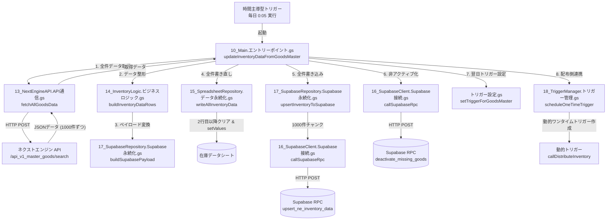
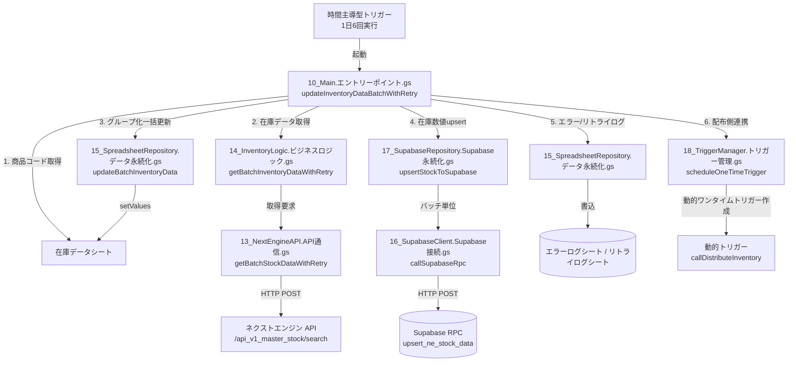
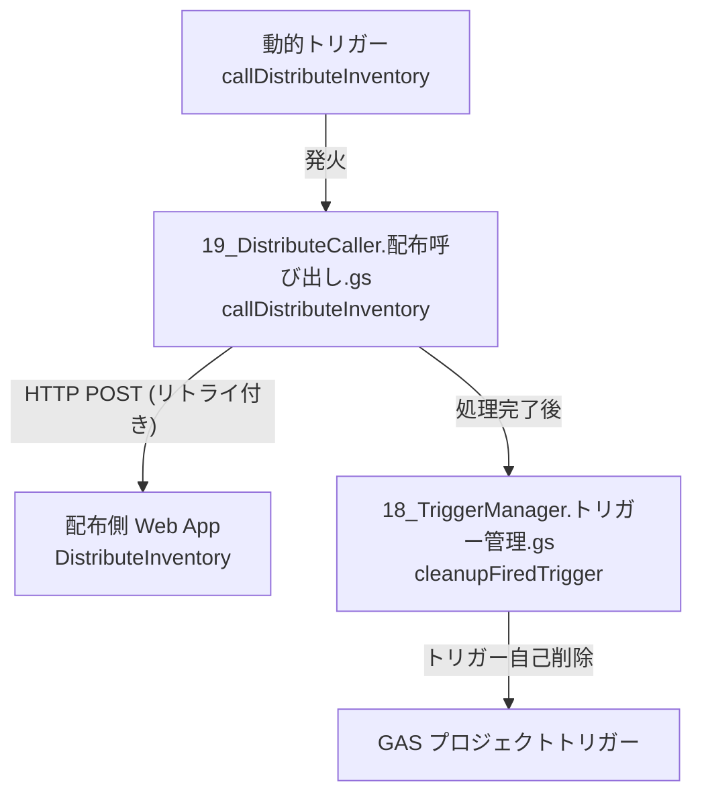

# ネクストエンジン在庫情報取得 (GetInventoryData)

ネクストエンジン（NE）の商品・在庫データを Google Apps Script（GAS）で取得し、Google スプレッドシートおよび **Supabase（PostgreSQL）** に同期する自動化プロジェクトです。

認証には NEAuth ライブラリ（`認証_ライブラリ.gs`）を使用しています。スプレッドシートは既存の IMPORTRANGE 連携を維持しつつ、Supabase を新たなデータストアとして追加した二重書き込み構成で運用します。

---

## 1. 全体構成とアーキテクチャ

本システムは、ネクストエンジン API から取得したデータを Google スプレッドシートと Supabase に二重書き込みし、最終的に配布側（DistributeInventory）へ動的トリガーを用いて即座にデータ同期を通知する仕組みで構成されています。

### A. 商品マスタ全件同期フロー (updateInventoryDataFromGoodsMaster)
毎日深夜（0:05）に実行され、商品マスタから全件の商品情報および在庫情報を取得し、スプレッドシートと Supabase のデータを完全にリフレッシュします。同期から外れた（廃止された）商品は自動的に非アクティブ化されます。



### B. 在庫情報リアルタイム更新フロー (updateInventoryDataBatchWithRetry)
日中に1日6回実行され、スプレッドシートの既存商品コードリストをベースに、在庫マスタから現在の在庫数値をバッチ（1000件単位）で取得し、差分のみをスプレッドシートおよび Supabase に上書き更新します。



### C. 配布側 (DistributeInventory) への動的ワンタイムトリガー連携
同期・更新完了後、即時（デフォルト30秒後）に実行されるワンタイムトリガーを作成し、配布プロジェクトの Web App（Webhook）を呼び出して処理を連動させます。



---

#### テキスト形式での処理フロー

Mermaidダイアグラムが正しく表示されない環境（ローカルプレビュー等）の場合は、以下のテキストフローをご参照ください。

```
■ 処理フローA. 商品マスタ全件同期 (毎日 0:05 起動)
1. 実行開始 (10_Main.gs: updateInventoryDataFromGoodsMaster)
   │  ├── リトライ統計のリセット (12_Logger.gs)
   │
   ├── 2. 商品マスタAPIから全件取得 (13_NextEngineAPI.gs: fetchAllGoodsData)
   │    ├── offset=0 から 1000件ずつページネーション取得
   │    └── ロケーションに「xxxxxx」を含む商品を除外 (空欄は含む)
   │
   ├── 3. データ整形 (14_InventoryLogic.gs: buildInventoryDataRows)
   │    └── スプレッドシート書き込み用の2次元配列（A〜L列）に変換
   │
   ├── 4. スプレッドシート全件書き直し (15_SpreadsheetRepository.gs: writeAllInventoryData)
   │    ├── 2行目以降の既存データを一括クリア (contentsOnly)
   │    └── ヘッダー再生成および整形済みデータの一括書き込み (setValues 1回)
   │
   ├── 5. Supabaseへの全件書き込み (17_SupabaseRepository.gs: upsertInventoryToSupabase)
   │    ├── データをSupabaseペイロードに変換 (buildSupabasePayload)
   │    └── 1000件ずつのチャンクに分割し、RPC `upsert_ne_inventory_data` を呼び出し
   │
   ├── 6. 同期から外れた（廃止された）商品の非アクティブ化 (10_Main.gs)
   │    └── RPC `deactivate_missing_goods` を呼び出し、Supabase上で `is_active = FALSE` に設定
   │
   ├── 7. 実行タイムスタンプ記録 (15_SpreadsheetRepository.gs: recordExecutionTimestamp)
   │    └── 指定ログシートのA1セルに実行日時を記録
   │
   ├── 8. 配布側 (DistributeInventory) への連携 (18_TriggerManager.gs)
   │    └── 30秒後（デフォルト）に起動するワンタイムトリガー `callDistributeInventory` を設定
   │
   └── 9. 翌日トリガーの自動登録 (トリガー設定.gs: setTriggerForGoodsMaster)
        └── 翌日の 0:05 に実行するトリガーを自動登録（自己スケジューリング）

■ 処理フローB. 在庫情報リアルタイム更新 (1日6回)
1. 実行開始 (10_Main.gs: updateInventoryDataBatchWithRetry)
   │  ├── リトライ統計のリセット (12_Logger.gs)
   │
   ├── 2. 更新対象商品コードの取得 (10_Main.gs)
   │    └── 在庫データシート of A列2行目以降から有効なコードを取得し、行番号をMap化
   │
   ├── 3. 在庫データの一括取得・整形 (14_InventoryLogic.gs: getBatchInventoryDataWithRetry)
   │    └── 在庫マスタAPI `getBatchStockDataWithRetry` を呼び出し (指数バックオフ最大3回リトライ)
   │
   ├── 4. スプレッドシート更新 (15_SpreadsheetRepository.gs: updateBatchInventoryData)
   │    └── 連続した行をグループ化して setValues の回数を最小化して一括書き込み
   │
   ├── 5. Supabase更新 (17_SupabaseRepository.gs: upsertStockToSupabase)
   │    └── 在庫数値のみ（商品名・JAN除く）を RPC `upsert_ne_stock_data` で更新
   │
   ├── 6. エラーログおよびリトライ統計の記録 (15_SpreadsheetRepository.gs)
   │    ├── 発生したエラーを「エラーログ」シートに追記 (logErrorsToSheet)
   │    └── リトライ統計が0%でない場合のみ「リトライログ」シートに追記 (logRetryStatsToSheet)
   │
   ├── 7. 実行タイムスタンプ記録 (15_SpreadsheetRepository.gs: recordExecutionTimestamp)
   │
   └── 8. 配布側 (DistributeInventory) への連携 (18_TriggerManager.gs)
        └── 30秒後（デフォルト）に起動するワンタイムトリガー `callDistributeInventory` を設定
```

---

## 2. 主な機能

### 1. 商品マスタ全件同期 (1日1回 / 0:05 実行)
**実行関数：** `updateInventoryDataFromGoodsMaster`
- ネクストエンジン商品マスタ API から全件を取得し、スプレッドシートおよび Supabase を完全に同期します。
- ロケーション名に `xxxxxx` が含まれる商品はインポート対象から除外されます。
- データのページネーション（1000件単位）に標準対応しています。
- 同期から外れた（ネクストエンジン側で廃止された）商品を一括非アクティブ化します。
- 実行完了後に翌日分のトリガーを自動登録します（自己スケジューリング方式）。

### 2. 在庫情報リアルタイム更新 (1日6回 / 時間指定)
**実行関数：** `updateInventoryDataBatchWithRetry`
- 在庫数・引当数・フリー在庫数・欠品数のいずれかに変化がある場合のみ `更新日時` を更新
- 1,000件バッチ処理（約3,200件を約18秒で処理）
- エクスポネンシャルバックオフによる自動リトライ（最大3回）

### 3. 差分取得機能
**提供関数：** `getChangedInventorySince(since)`

- 指定日時以降に `更新日時` が更新された商品のみを Supabase から取得
- `saveLastExecutedAt()` / `loadLastExecutedAt()` で前回実行日時を管理
- 将来の外部連携・通知処理の基盤として利用可能

### 4. 配布側（DistributeInventory）への動的ワンタイムトリガー連携
在庫情報一括更新（`updateInventoryDataBatchWithRetry`）および商品マスタ同期（`updateInventoryDataFromGoodsMaster`）の完了後に、動的ワンタイムトリガーを生成し、指定時間（デフォルト30秒）経過後に配布側プロジェクトの Web App（Webhook）を呼び出します。これにより、従来の固定5分後起動スケジュールに依存せず、よりリアルタイム性の高い在庫情報の配布を実現します。

---

## 取得項目一覧

| 列 | 項目名 | フィールド名 | 更新元 |
|----|--------|-------------|--------|
| A | 商品コード | goods_id | 商品マスタ |
| B | 商品名 | goods_name | 商品マスタ |
| C | 在庫数 | stock_quantity | 商品マスタ / 在庫マスタ |
| D | 引当数 | stock_allocation_quantity | 商品マスタ / 在庫マスタ |
| E | フリー在庫数 | stock_free_quantity | 商品マスタ / 在庫マスタ |
| F | 予約在庫数 | stock_advance_order_quantity | 商品マスタ / 在庫マスタ |
| G | 予約引当数 | stock_advance_order_allocation_quantity | 商品マスタ / 在庫マスタ |
| H | 予約フリー在庫数 | stock_advance_order_free_quantity | 商品マスタ / 在庫マスタ |
| I | 不良在庫数 | stock_defective_quantity | 商品マスタ / 在庫マスタ |
| J | 発注残数 | stock_remaining_order_quantity | 商品マスタ / 在庫マスタ |
| K | 欠品数 | stock_out_quantity | 商品マスタ / 在庫マスタ |
| L | JANコード | goods_jan_code | 商品マスタ |
| - | 更新日時 | - | Supabase（RPC内で自動セット）|

---

## 4. ファイル構成と定義されている主要関数の詳細説明

本プロジェクトの各ファイル役割と、内部に定義されている主要関数の詳細です。

| ファイル名 | 役割 |
|---|---|
| [00_認証ライブラリ使用必須関数.gs] | ネクストエンジン API 認証のコールバック処理とトークン初期取得 |
| [10_Main.エントリーポイント.gs] | システム全体の実行フロー制御およびオーケストレーション |
| [11_Config.設定管理.gs] | 定数定義、各種スクリプトプロパティ取得の共通ラッパー |
| [12_Logger.ログ管理.gs] | ログ出力（ログレベル対応）、リトライ統計情報のグローバル管理 |
| [13_NextEngineAPI.API通信.gs] | ネクストエンジン API（商品マスタ・在庫マスタ）との通信とトークン更新 |
| [14_InventoryLogic.ビジネスロジック.gs] | 取得データの正規化、スプレッドシートや Supabase 向けデータ変換 |
| [15_SpreadsheetRepository.データ永続化.gs] | スプレッドシートへの一括書き込み、エラーログ・リトライログシート記録 |
| [16_SupabaseClient.Supabase接続.gs] | Supabase 接続の確立、RPC（ストアドファンクション）呼び出し汎用層 |
| [17_SupabaseRepository.Supabase永続化.gs] | Supabase への一括 upsert・差分抽出および実行日時保存 |
| [18_TriggerManager.トリガー管理.gs] | 動的ワンタイムトリガーのスケジュール設定、発火後の自己クリーンアップ |
| [19_DistributeCaller.配布呼び出し.gs] | 配布側（DistributeInventory）の Web App Webhook の呼び出し |
| [トリガー設定.gs] | 定期実行時間スケジュールトリガーの自動登録・削除（エラー回復付き） |
| [99_Tests.テスト.gs] | 各種疎通・書き込み・差分連携テストおよび SRE ダッシュボード表示 |

---

### [00_認証ライブラリ使用必須関数.gs]
* **`doGet(e)`**
  * **説明**: ネクストエンジン API 認証のコールバックURLを受け取るためのエンドポイント関数。認証完了後にアクセストークンを自動取得し保存します。
  * **引数**: `e` (Object) - リクエストイベントオブジェクト
  * **戻り値**: `HtmlOutput`
* **`testGenerateAuthUrl()`**
  * **説明**: ネクストエンジン API にログインして本スクリプトを許可するための認証用URLをログに出力します。

### [10_Main.エントリーポイント.gs]
* **`updateInventoryDataBatchWithRetry()`**
  * **説明**: 日中の在庫情報一括更新を実行するメインエントリーポイント。スプレッドシートの既存データを読み込み、在庫マスタAPIからバッチでデータを取得してスプレッドシートとSupabaseに同期し、完了後に配布側トリガーをスケジュールします。
* **`updateInventoryDataFromGoodsMaster()`**
  * **説明**: 深夜の商品マスタ同期を実行するメインエントリーポイント。商品マスタAPIから全件を取得し、スプレッドシートとSupabaseを完全に書き換え、廃止商品を非アクティブ化して、翌日トリガーを登録します。

### [11_Config.設定管理.gs]
* **`getSpreadsheetConfig()`**
  * **説明**: 動作対象のスプレッドシートIDおよびシート名を取得します。
  * **戻り値**: `{ SPREADSHEET_ID: string, SHEET_NAME: string }`
* **`getStoredTokens()`**
  * **説明**: スクリプトプロパティに保存されているアクセストークン及びリフレッシュトークンを取得します。
  * **戻り値**: `{ accessToken: string, refreshToken: string }`
* **`getReceiverWebAppUrl()`** / **`getSharedToken()`** / **`getDistributeTriggerDelayMs()`**
  * **説明**: 配布側（DistributeInventory）プロジェクトの Web App 接続設定と共有トークン、遅延時間を取得します。

### [12_Logger.ログ管理.gs]
* **`logWithLevel(requiredLevel, message, ...args)`**
  * **説明**: プロパティ `LOG_LEVEL` に応じてログの出力を制限します。
  * **引数**:
    - `requiredLevel` (number): ログ出力レベル（`1`〜`3`）
    - `message` (string): ログメッセージ
* **`logAPIErrorDetail(apiName, requestData, responseData, error)`**
  * **説明**: APIリクエストが失敗した際に、リクエスト情報、レスポンス情報、エラーオブジェクトの詳細を整理してエラーログとして出力します。
* **`recordRetryAttempt(batchNumber, attemptNumber)`** / **`showRetryStats()`**
  * **説明**: API失敗時のリトライ回数・発生バッチ数等の統計をグローバル管理し、実行完了時にサマリーを表示します。

### [13_NextEngineAPI.API通信.gs]
* **`getBatchStockDataWithRetry(goodsCodeList, tokens, batchNumber, maxRetries)`**
  * **説明**: ネクストエンジンの在庫マスタAPI (`/api_v1_master_stock/search`) を呼び出し、バッチ単位で在庫数値を取得します。一時的な接続エラー時は指数バックオフで自動再試行します。
  * **引数**:
    - `goodsCodeList` (string[]): 検索対象の商品コード配列（最大1000件）
    - `tokens` (Object): 認証トークン
  * **戻り値**: `Map<string, Object>` - キー: 商品コード, 値: 在庫マスタ生データ
* **`fetchAllGoodsData(tokens)`**
  * **説明**: 商品マスタ API (`/api_v1_master_goods/search`) から全件の商品情報をページネーション（1000件/回）で取得します。ロケーション除外フィルタ（`xxxxxx`）が適用されます。
  * **戻り値**: `Map<string, Object>` - キー: goods_id, 値: 商品マスタ生データ
* **`updateStoredTokens(accessToken, refreshToken)`**
  * **説明**: 新しいトークンが返された場合、現在のプロパティと比較し、差分がある場合のみ上書き更新します（PropertiesServiceの書き込みクォータ消費を節約します）。

### [14_InventoryLogic.ビジネスロジック.gs]
* **`getBatchInventoryDataWithRetry(goodsCodeList, tokens, batchNumber)`**
  * **説明**: API通信層と永続化層の仲介を行い、大文字小文字の正規化（照合ゆれ吸収）をしつつ、在庫生データを `InventoryData` オブジェクトの Map に整形します。
  * **戻り値**: `Map<string, Object>` - キー: 元の商品コード, 値: 整形済みオブジェクト
* **`buildInventoryDataRows(goodsMap)`**
  * **説明**: 商品マスタ API からの取得 Map データを、スプレッドシート書き込み用の 12列（A〜L列）の 2次元配列に整形します。
  * **戻り値**: `Array[]` - 2次元配列

### [15_SpreadsheetRepository.データ永続化.gs]
* **`updateBatchInventoryData(sheet, batch, inventoryDataMap, rowIndexMap)`**
  * **説明**: 在庫データシートの複数行をバッチ単位で更新します。更新行をソートし、連続した行をグループ化して `setValues()` を一括適用することで、スプレッドシート API の呼び出し回数を劇的に減らし高速化します。
  * **戻り値**: `{ updated: number, results: Array }`
* **`writeAllInventoryData(sheet, rows)`**
  * **説明**: 商品マスタ同期用。シートの2行目以降の既存データを一度全てクリア（内容のみクリアで高速化）し、ヘッダーと最新データを `setValues()` 2回で一括書き直しします。
* **`logErrorsToSheet(errorDetails)`** / **`logRetryStatsToSheet()`**
  * **説明**: 処理中に発生したエラーおよびリトライ統計を「エラーログ」「リトライログ」シートに追記します。シートが存在しない場合は自動作成します。リトライ率が 0% の場合は記録をスキップします。

### [16_SupabaseClient.Supabase接続.gs]
* **`callSupabaseRpc(functionName, params)`**
  * **説明**: Supabase の RPC エンドポイント（`/rest/v1/rpc/<関数名>`）を呼び出します。一時的な HTTP 5xx エラーやタイムアウト時は、自動で最大3回の指数バックオフリトライを行います。クライアントエラー（4xx）時はリトライせず即時例外をスローします。
  * **戻り値**: `{ success: boolean, statusCode: number, body: string }`
* **`querySupabaseTable(tableName, queryParams)`**
  * **説明**: Supabase データベース上のテーブルからデータを REST API (GET) 経由で取得します（差分検知用）。
  * **戻り値**: `{ success: boolean, statusCode: number, data: Array }`

### [17_SupabaseRepository.Supabase永続化.gs]
* **`upsertInventoryToSupabase(goodsMap)`**
  * **説明**: 商品マスタ全件を Supabase 用ペイロードに変換し、1000件ずつのチャンクに分割して RPC `upsert_ne_inventory_data` を呼び出して書き込みます。
* **`upsertStockToSupabase(inventoryDataMap)`**
  * **説明**: 在庫数値のみを Supabase 用ペイロードに変換し、バッチ単位で RPC `upsert_ne_stock_data` を呼び出して同期します。
* **`getChangedInventorySince(since)`**
  * **説明**: 指定した日時（基準日時）以降に `更新日時` が更新されたレコードを Supabase から取得します。
* **`saveLastExecutedAt()`** / **`loadLastExecutedAt(fallbackHours)`**
  * **説明**: 最終差分取得日時（ISO 8601文字列/UTC）をスクリプトプロパティ `SUPABASE_LAST_EXECUTED_AT` に対して保存・読み込みします。

### [18_TriggerManager.トリガー管理.gs]
* **`scheduleOneTimeTrigger(functionName, delayMs)`**
  * **説明**: 指定した関数を、指定ミリ秒後に 1回だけ実行するワンタイムトリガーを作成します。既存の重複トリガーや余分なスクリプトプロパティはあらかじめ自動で削除されます。
  * **戻り値**: `string` (作成されたトリガーID)
* **`cleanupFiredTrigger()`**
  * **説明**: 実行済みのワンタイムトリガーを自身のハンドラ内で検出して削除し、GAS のプロジェクトトリガー数が上限に達するのを防ぎます。

### [19_DistributeCaller.配布呼び出し.gs]
* **`callDistributeInventory()`**
  * **説明**: 動的トリガー発火時に呼び出されるラッパー関数。配布側 Web App に POST を送信したのち、必ずトリガーのクリーンアップを実行します。
* **`callDistributeInventoryWebAppWithRetry(payload)`**
  * **説明**: 認証用トークンおよび実行時刻を含むペイロードを、最大3回のエクスポネンシャルバックオフ付きで配布側 Web App (Webhook) に送信します。

### [トリガー設定.gs]
* **`setTrigger()`**
  * **説明**: 定期在庫更新（1日6回）のトリガーを登録します。すでに登録済みのトリガーは事前に安全に削除します。
* **`setTriggerForGoodsMaster()`**
  * **説明**: 商品マスタ全件同期（毎日 0:05）を実行するトリガーを、翌日日付の 0:05 時刻指定で登録します。
* **`deleteTriggersForFunction(functionName, maxRetry, baseSleepMs)`**
  * **説明**: 指定された関数に紐づくすべての既存トリガーを削除します。削除時の GAS レート制限エラーを回避するため、削除ごとのスリープ（500ms）と指数バックオフ付きリトライ機構を備えています。

---

## Supabase 構成

### テーブル

| テーブル名 | 用途 |
|-----------|------|
| `public."NE_InventoryData"` | 在庫情報の保存先（最新データ / カレントテーブル） |
| `public."NE_InventoryHistory"` | 在庫情報の変更履歴保存先（履歴データ / ヒストリーテーブル） |

### RPC 関数

| 関数名 | 呼び出し元 | 用途 |
|--------|-----------|------|
| `upsert_ne_inventory_data` | `updateInventoryDataFromGoodsMaster` | 商品マスタ全件 upsert（全列更新）および履歴保存 |
| `upsert_ne_stock_data` | `updateInventoryDataBatchWithRetry` | 在庫マスタ差分 upsert（在庫数値列のみ更新）および履歴保存 |
| `deactivate_missing_goods` | `updateInventoryDataFromGoodsMaster` | 同期対象から外れた（廃止）商品の一括非アクティブ化および履歴保存 |

### 差分更新と履歴保存の仕組み

各 RPC 関数では、指定のデータ項目に変化がある場合のみカレントテーブル（`NE_InventoryData`）の `更新日時` を更新し、その変更されたレコードを履歴テーブル（`NE_InventoryHistory`）に追記します。

- **差分更新・履歴保存のトリガーとなる条件：**
  - 在庫数・引当数・フリー在庫数・欠品数のいずれかに変化がある場合（全関数共通）
  - JANコードに変更がある場合（`upsert_ne_inventory_data` のみ）
  - 非アクティブから再度インポートされてアクティブ化（`is_active = FALSE` から `TRUE`）される場合（`upsert_ne_inventory_data` のみ）
  - 対象商品コードが同期データから外れ、非アクティブ化される場合（`deactivate_missing_goods` のみ）

変化がない商品はカレントテーブルの `更新日時` を変更せず、履歴テーブルへの保存もスキップします。これにより `getChangedInventorySince()` を通じて、実際に更新された商品のみを効率的に検知できます。

---

## 6. 導入・セットアップ手順

本システムを導入するための初期セットアップ手順です。

### ステップ 1: スプレッドシートの準備
1. 在庫データ管理用の Google スプレッドシートを用意します。
2. スプレッドシート内に以下のシートを用意します：
   - **メインシート**（デフォルト: `"在庫データ"`）: A列〜L列までの在庫情報が書き込まれるシート。
   - **ログシート**（デフォルト: `"ログ"`）: 実行完了日時が記録されるシート。
3. 初回実行時、またはエラー発生時に以下のシートが**自動生成**されます：
   - **エラーログ**: 処理中に発生したエラーの詳細履歴が蓄積されます。
   - **リトライログ**: APIリトライが発生した際の統計情報が蓄積されます。

### ステップ 2: GASプロジェクトの作成とライブラリ追加
1. スプレッドシートのメニューから **「拡張機能」 ＞ 「Apps Script」** を選択します。
2. GAS エディタの左メニュー「ライブラリ」の横の「＋」をクリックします。
3. 認証用プロジェクト（NEAuth）のスクリプト ID を入力して検索します。
4. 識別子を `NEAuth` とし、最新バージョンを選択して「追加」をクリックします。
5. 本リポジトリの `GetInventoryData` ディレクトリ配下にある全てのスクリプトファイル（.gs）をGASプロジェクト内に新規作成し、コードをコピー＆ペーストして配置します。

### ステップ 3: Webアプリとしてデプロイ
ネクストエンジン API の OAuth2 認証コールバックを受け取るため、プロジェクトを Web アアプリとしてデプロイします。
1. エディタ右上の **「デプロイ」 ＞ 「新しいデプロイ」** をクリックします。
2. 種類の選択（歯車マーク）から **「ウェブアプリ」** を選択します。
3. 以下を設定して「デプロイ」をクリックします：
   - 説明: 任意のバージョン説明
   - 次のユーザーとして実行: **「自分」**
   - アクセスできるユーザー: **「全員」**（ネクストエンジン API からのコールバックを受信するため必須）
4. デプロイ後に発行される **「ウェブアプリのURL」** をコピーします。

### ステップ 4: スクリプトプロパティの設定
1. GASエディタの左メニューから **「プロジェクトの設定（歯車マーク）」** を選択します。
2. **「スクリプトプロパティを追加」** を選択し、後述する[スクリプトプロパティ一覧]に基づいて必要な値をすべて設定します。
3. 特にステップ3でコピーしたウェブアプリのURLを `REDIRECT_URI` に設定することを忘れないでください。

### ステップ 5: ネクストエンジン API 認証の実行
1. `00_認証ライブラリ使用必須関数.gs` または `99_Tests.テスト.gs` にある `testGenerateAuthUrl()` を実行します。
2. GASの実行ログに出力された **認証URL** をコピーし、ブラウザでアクセスします。
3. ネクストエンジンのログイン画面が表示されるので、ログインしてアプリの利用を許可します。
4. 認証が完了すると、自動的にスクリプトプロパティの `ACCESS_TOKEN` および `REFRESH_TOKEN` が設定され、API接続が可能になります。

### ステップ 6: 動作診断テストの実行
1. `99_Tests.テスト.gs` を開き、以下の順でテスト関数を実行して接続を確認します：
   - **`verifyConfiguration()`**: スクリプトプロパティやトークンの状態を確認します。
   - **`testSupabaseConnection()`**: Supabase データベースとの疎通を確認します。
   - **`testPhase5_IntegrationTest()`**: 商品マスタ全件取得からスプレッドシート書き込み、Supabaseへのupsert、非アクティブ化までの一連の統合テストを実行します（※事前に `TEST_SPREADSHEET_ID` プロパティが設定されている必要があります）。

### ステップ 7: スケジュールトリガーの自動登録
1. 商品マスタ全件同期（1日1回）のトリガーを登録するため、`setTriggerForGoodsMaster()` を実行します（毎日 0:05 に実行されるよう自己スケジューリングトリガーが仕込まれます）。
2. 日中の在庫更新（1日6回）のトリガーを登録するため、`setTrigger()` を実行します（毎日指定された時刻に実行されるトリガーが自動登録されます）。

---

## 7. スクリプトプロパティ設定

GAS エディタの「プロジェクトの設定」 ＞ 「スクリプトプロパティ」に設定する環境変数一覧です。

| 分類 | キー名 | 必須 | 説明 | 例 |
|---|---|---|---|---|
| **NE API 認証** | `CLIENT_ID` | **必須** | ネクストエンジンのクライアントID | `app_xxxxxx` |
| | `CLIENT_SECRET` | **必須** | ネクストエンジンのクライアントシークレット | `xxxxxxxxxxxx` |
| | `REDIRECT_URI` | **必須** | 本アプリのWeb AppデプロイURL | `https://script.google.com/.../exec` |
| | `ACCESS_TOKEN` | 自動管理 | APIアクセストークン（認証後に自動保存） | `eyJhbGciOi...` |
| | `REFRESH_TOKEN` | 自動管理 | APIリフレッシュトークン（認証後に自動保存） | `eyJhbGciOi...` |
| **スプレッドシート** | `SPREADSHEET_ID` | **必須** | 在庫データを更新するスプレッドシートID | `1A2B3C4D5E...` |
| | `SHEET_NAME` | **必須** | 在庫情報を表示するシート名 | `"在庫データ"` |
| | `LOG_SHEET_NAME` | **必須** | 実行完了時間を記録するログシート名 | `"ログ"` |
| **Supabase 接続** | `SUPABASE_URL` | **必須** | Supabase プロジェクトURL | `https://xxxxxx.supabase.co` |
| | `SUPABASE_KEY` | **必須** | Supabase の anon key (Service Roleキーも可) | `eyJhbGciOi...` |
| | `SUPABASE_LAST_EXECUTED_AT`| 自動管理| 最終差分取得日時（自動保存・手動設定不要） | `2026-07-05T06:00:00.000Z` |
| **トリガー・デバッグ** | `TRIGGER_FUNCTION_NAME`| **必須** | 定期実行する関数名（通常は在庫更新関数） | `updateInventoryDataBatchWithRetry` |
| | `TRIGGER_MODE` | **必須** | スケジュール登録モード（`TODAY` または `TOMORROW`）| `TODAY` |
| | `LOG_LEVEL` | 任意 | ログ出力の詳しさ（`1`: MINIMAL / `2`: SUMMARY / `3`: DETAILED） | `2` |
| | `TEST_SPREADSHEET_ID` | 任意 | 統合テスト（IntegrationTest）で使用するテスト用SS of ID | `1A2B3C4D5E...` |
| **配布側連携** | `RECEIVER_WEBAPP_URL` | 任意 | 配布側（DistributeInventory）のWeb App URL | `https://script.google.com/.../exec` |
| | `API_SHARED_TOKEN` | 任意 | 配布側と共通で設定する認証用の共有トークン | `任意のセキュリティトークン` |
| | `DISTRIBUTE_TRIGGER_DELAY_MS`| 任意| トリガー登録から発火までのディレイ（ミリ秒、デフォルト: 30000 = 30秒） | `30000` |

---

## 8. 定期実行トリガー構成

日中の在庫数値の自動同期のため、以下のスケジュールで実行トリガーが設定されます。
`TRIGGER_MODE` に応じて、当日（TODAY）または翌日（TOMORROW）に自動スケジュールされます。

| 実行時刻 | 実行関数 | 同期対象 | 目的 |
|---|---|---|---|
| **0:05** | `updateInventoryDataFromGoodsMaster` | 商品マスタ API (全件) | 商品マスタの全件同期 ＆ 廃止商品の一括非アクティブ化、翌日トリガー自動再登録 |
| **7:55** | `updateInventoryDataBatchWithRetry` | 在庫マスタ API (差分) | 朝の在庫データ同期、終了後に配布側への動的通知 |
| **9:55** | `updateInventoryDataBatchWithRetry` | 在庫マスタ API (差分) | 午前中の在庫データ同期、終了後に配布側への動的通知 |
| **13:25** | `updateInventoryDataBatchWithRetry` | 在庫マスタ API (差分) | 午後の在庫データ同期、終了後に配布側への動的通知 |
| **15:55** | `updateInventoryDataBatchWithRetry` | 在庫マスタ API (差分) | 夕方の在庫データ同期、終了後に配布側への動的通知 |
| **18:55** | `updateInventoryDataBatchWithRetry` | 在庫マスタ API (差分) | 退勤前の在庫データ同期、終了後に配布側への動的通知 |
| **20:55** | `updateInventoryDataBatchWithRetry` | 在庫マスタ API (差分) | 夜間の在庫データ同期、終了後に配布側への動的通知 |

*(※0:05 の商品マスタ同期完了時に、日中の在庫同期がスムーズに行えるよう、自己スケジューリングにより翌日の 0:05 トリガーが自動登録されます。)*

---

## 9. SRE（安定化・安全稼働）のための機能詳細

本システムでは、API通信の失敗や Google スプレッドシートの制限、GASの実行時間上限（6分）などに対処し、安全かつ安定して稼働し続けるための以下の取り組み（SRE的機能）が標準で実装されています。

1. **指数バックオフ（Exponential Backoff）リトライ機構**
   - ネクストエンジン API および Supabase API との通信時に一時的なエラー（HTTP 429, 5xx系やネットワーク瞬断）が発生した場合、待機時間を **1秒 ➔ 2秒 ➔ 4秒** と倍増させながら最大3回まで再試行を行います。
   - クライアント起因のエラー（認証エラー `401` や不正なパラメータ `400`）は、リトライしても解決しないため即座にエラーとして処理を中断し、GASの実行制限時間を無駄に消費しない設計にしています。

2. **スプレッドシート一括更新の最適化（グループ化 setValues）**
   - 日中の在庫更新において、1セルずつ更新すると API 制限やGASの制限時間を超過します。本システムでは更新行を事前にソートし、連続する行を検知して一括の `setValues()` を適用します。これにより、3000件超の在庫更新を約18秒という極めて短い時間で完了させます。

3. **PropertiesService の書き込み制限（クォータ節約）**
   - ネクストエンジン API はレスポンスのたびに新しいトークンを返す仕様ですが、値に変更がない場合はプロパティの書き込みを自動でスキップします。これにより、GASの PropertiesService の書き込み制限エラーを回避します。

4. **動的ワンタイムトリガーによる配布自動連動**
   - 在庫同期や商品マスタ更新の終了時、配布側（DistributeInventory）の Web App を即時呼び出します。
   - 同期処理自体が長引くことがあるため、固定時間トリガーではなく、処理が「完了した瞬間」から30秒後（デフォルト）に発火するワンタイムトリガーを動的に作成します。また、発火後は自分自身のトリガーを自動でクリーンアップ（自己削除）します。

5. **自動で翌日分のトリガーを再構築する自己スケジューリング**
   - 毎日 0:05 の商品マスタ同期完了時に、翌日の 0:05 に実行するトリガーを自動的に作成し直します。これにより、手動でのスケジュール管理ミスを防止します。

6. **リトライログ・エラーログの自動蓄積・自動スキップ**
   - エラー情報を「エラーログ」シートに蓄積し、リトライ発生時には「リトライログ」シートに発生率などを自動記録します。リトライが発生しなかった（リトライ率 0%）の実行ではログシートへの余分な書き込みをスキップし、データをきれいに保ちます。

---

## 10. 主要テスト関数の解説とテスト手順

`99_Tests.テスト.gs` に定義されているテスト関数は、本番環境のセットアップ完了時の接続確認や、トラブル発生時の診断に利用できます。

### 動作確認・診断用テスト

| テスト関数名 | 目的と確認内容 | 実行手順 |
|---|---|---|
| **`verifyConfiguration()`** | スクリプトプロパティの必須値やトークンの取得状況を診断します。 | 1. スクリプトエディタの上部で本関数を選択して「実行」をクリック。<br>2. 実行ログに「✓ 設定値チェック合格」と表示されることを確認。 |
| **`testSupabaseConnection()`** | Supabase データベースとの疎通確認（GET/POST）を実行します。 | 1. 本関数を選択して実行。<br>2. Supabase から正常に応答（200番台）が返ってくることを確認。 |
| **`showSREDashboard()`** | システムの健全性、直近のエラー率やリトライ発生ログをダッシュボード形式で表示します。 | 1. 本関数を選択して実行。<br>2. ログに直近の実行ログやエラー率が一覧表示されるので、異常値がないか確認。 |


## 11. トラブルシューティング ＆ 注意事項

### GCPプロジェクト紐付け時の OAuth 認証リセットと 403 エラー対応
本 GAS プロジェクトにカスタムの GCP（Google Cloud）プロジェクトを紐付けた際、以下の現象とアクセス拒否エラーが発生することがあります。

1. **OAuth 認可状態のリセット**
   - デフォルトの GCP プロジェクトから独自の標準 GCP プロジェクトへ紐付けを変更すると、これまでに完了していたアクセス承認（OAuth 認可）が一旦すべてリセットされます。
   - 紐付けを変更した後は、必ず GAS エディタ上で手動で関数（テスト関数など）を実行し、再度アクセス権の承認（OAuth 認証フロー）を行ってください。

2. **Web App（doGet / doPost）が 403 エラーで拒否される場合**
   - Web App を公開している状態で、紐付けた GCP プロジェクトの公開ステータスが **「テスト」** になっていると、外部（または自身）からの Web Webhook や GET/POST リクエストが `403 Forbidden` となり、アクセスが拒否される現象が発生します。
   - **対処手順**:
     1. [Google Cloud Console](https://console.cloud.google.com/) にアクセスし、紐付けた GCP プロジェクトを開きます。
     2. 左メニューから **「API とサービス」 ＞ 「OAuth 同意画面」** を選択します。
     3. 画面上に表示されている対象のアプリ（OAuth同意画面の設定）をクリックし、画面を下までスクロールして **「テストユーザー」** セクションを表示します。
     4. Web App の実行・テストに使用するご自身の Google アカウントがテストユーザーとして登録されているか確認し、登録されていない場合は **「+ ADD USERS（ユーザーを追加）」** から追加してください。

### 機能別の部分テスト

* **`testRetryFunction()`**: APIリトライ機構が正常に機能し、指数バックオフで再試行するかを検証します。
* **`testBuildSupabasePayload()`** / **`testBuildStockPayload()`**: 取得した商品データが Supabase 向け（日本語キー、JANの数値変換）に正しく整形されるかを検証します。
* **`testUpsertInventoryToSupabase()`**: 商品マスタ全件（ダミーまたは一部）を Supabase に upsert するテストを実行します。
* **`testUpsertStockToSupabase()`**: 在庫データのみを Supabase に upsert するテストを実行します。
* **`testGetChangedInventorySince()`** / **`testLastExecutedAtFlow()`**: 差分取得用の前回実行日時の保存・読み出し、指定日時以降の更新分取得が正常か検証します。
* **`testCallDistributeInventory()`**: 配布側（DistributeInventory）の Web App URL に対して単発のテスト Webhook を送信し、配布側が正しく受け取れるかテストします。
* **`testDistributeTriggerEndToEnd()`**: 動的ワンタイムトリガーが自動作成され、発火後に自分自身を安全に削除（クリーンアップ）するE2Eの挙動を検証します。

### 統合テスト (導入時の最終確認)

* **`testPhase5_IntegrationTest()`**
  - **内容**: 商品マスタの全件取得 ➔ スプレッドシート（テスト用）書き込み ➔ Supabaseへの一括upsert ➔ 廃止商品の非アクティブ化までを、本番と同等のデータ量で一気通貫テストします。
  - **実行前の注意**: 必ずスクリプトプロパティ `TEST_SPREADSHEET_ID` にテスト用のスプレッドシートIDを設定してください。本番のスプレッドシートは書き換えられません。
  - **実行手順**:
    1. プロパティに `TEST_SPREADSHEET_ID` を設定。
    2. 本関数を実行。
    3. 実行ログで処理時間が6分以内に収まっているか、書き込まれたヘッダーやデータが正常かを確認。
