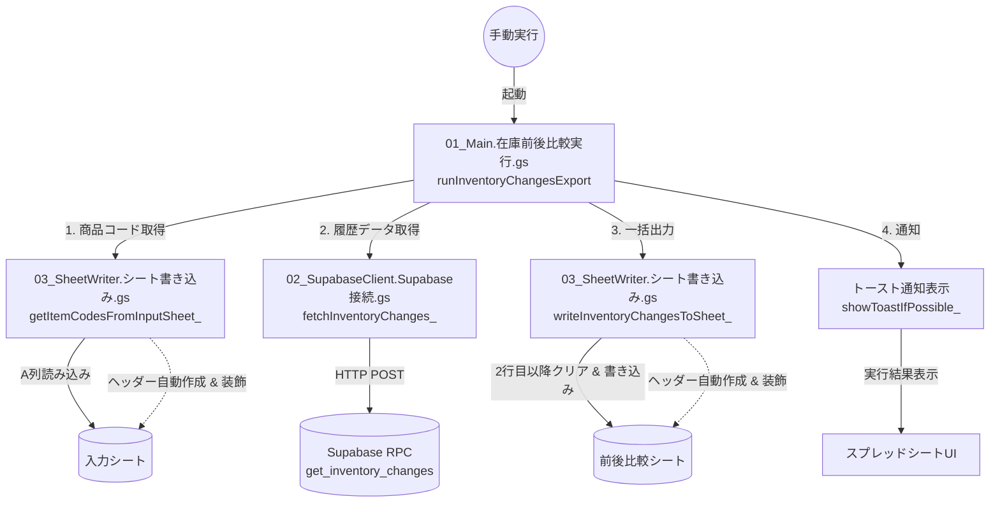

# 在庫前後比較データ エクスポートツール (InventoryChangesExport)

Supabase上のテーブルから、指定された商品コードの在庫の変更履歴を取得し、Google Spreadsheetの指定シートに出力するGoogle Apps Script (GAS) プロジェクトです。

既存の `GetInventoryData` / `DistributeInventory` プロジェクトとは完全に独立したスタンドアロンのモジュールとして動作します。

---

## 1. 全体構成とアーキテクチャ

本ツールは、大きく分けて「入力シートの読み込み」「Supabaseとの通信」「出力シートへの書き込み」の3つの要素から構成されており、これらをメイン実行モジュールがオーケストレーションします。

### モジュール間の関係・データフロー



#### テキスト形式での処理フロー

Mermaidダイアグラムが正しく表示されない環境（ローカルプレビュー等）の場合は、以下のテキストフローをご参照ください。

```
1. 手動実行 (01_Main.gs: runInventoryChangesExport)
   │
   ├── 2. 入力データの取得 (03_SheetWriter.gs: getItemCodesFromInputSheet_)
   │    ├── [入力] シートのA列から手動入力された商品コードを読み込み
   │    └── 重複する商品コードを自動的に排除 (Unique化)
   │
   ├── 3. 件数上限チェック (01_Main.gs)
   │    └── スクリプトプロパティ `MAX_ITEM_LIMIT` (デフォルト500件) を超える場合はエラーを投げて中断
   │
   ├── 4. Supabaseからの履歴データ取得 (02_SupabaseClient.gs: fetchInventoryChanges_)
   │    ├── POSTリクエストにより get_inventory_changes RPCを呼び出し
   │    └── [SRE] 一時的エラー発生時は最大3回自動リトライ (指数バックオフ: 2秒 ➔ 4秒 ➔ 8秒)
   │
   ├── 5. 前後比較シートへ出力 (03_SheetWriter.gs: writeInventoryChangesToSheet_)
   │    ├── [前後比較] シートのヘッダー自動作成・装飾 (背景オレンジ・白太字・中央揃え)
   │    ├── 2行目以降の既存データを一括クリア
   │    └── 日時(UTC)をJSTに変換し、スプレッドシートへ一括書き込み
   │
   └── 6. 処理完了通知 (01_Main.gs: showToastIfPossible_)
        └── スプレッドシートUIの右下にトースト表示 (UIが無いバックグラウンド環境ではログ出力のみで安全にスキップ)
```


---

## 2. 導入手順

本ツールを利用するための初期セットアップ手順です。

### ステップ 1: スプレッドシートの用意
1. 本ツール用のGoogle Spreadsheetを新規に作成（または既存のシートを利用）します。
2. スプレッドシート内に、以下の2つのシート（タブ）を作成します。
   - **「入力」シート**: 比較したい商品コードを手動で入力するシート。
   - **「前後比較」シート**: 実行結果を出力するシート。
   *(※シートが完全に空でも、実行時に自動でヘッダーがセット・装飾されます)*

### ステップ 2: GASプロジェクトの作成とコードの配置
1. スプレッドシートのメニューから **「拡張機能」 ＞ 「Apps Script」** を選択します。
2. Apps Scriptのエディタ上で、本リポジトリの `InventoryChangesExport` ディレクトリ配下にある3つのファイル（および必要に応じてテスト用ファイル）を新規作成し、コードをコピー＆ペーストします。
   - `01_Main.在庫前後比較実行.gs`
   - `02_SupabaseClient.Supabase接続.gs`
   - `03_SheetWriter.シート書き込み.gs`
   - `04_Test.テスト実行.gs` (任意: 検証・テスト用)

### ステップ 3: スクリプトプロパティの設定
1. Apps Scriptエディタの左メニューから **「プロジェクトの設定（歯車マーク）」** を選択します。
2. **「スクリプトプロパティを追加」** を選択し、以下のプロパティを設定します。

| キー名 | 必須/任意 | 内容 | 設定値の例 |
|---|---|---|---|
| `SUPABASE_URL` | **必須** | SupabaseのプロジェクトURL | `https://xxxxxx.supabase.co` |
| `SUPABASE_KEY` | **必須** | Supabaseのanonキー（またはサービスロールキー） | `eyJhbGciOi...` |
| `TARGET_SPREADSHEET_ID` | **必須** | 出力先のスプレッドシートID | `1A2B3C4D5E...` |
| `INPUT_SHEET_NAME` | 任意 | 商品コードの入力元シート名 | 設定なし（デフォルト: `"入力"`） |
| `OUTPUT_SHEET_NAME` | 任意 | 比較結果の出力先シート名 | 設定なし（デフォルト: `"前後比較"`） |
| `MAX_ITEM_LIMIT` | 任意 | 一度に処理可能な商品コードの上限件数 | 設定なし（デフォルト: `500`） |

---

## 3. ファイルと定義されている関数の詳細説明

### [01_Main.在庫前後比較実行.gs]

ツール全体の実行フローを統括するモジュールです。

#### `runInventoryChangesExport()`
* **説明**: 手動実行のためのメインエントリーポイントです。入力シートからのデータ読み込み、APIの呼び出し、出力シートへの書き込み、トースト通知を一連のフローとして実行します。
* **引数**: なし
* **戻り値**: なし
* **例外 (`@throws`)**: 接続エラー、上限超過バリデーションエラー、書き込み失敗などが発生した際、コンソールにエラーを出力した上で例外を再スローします。

#### `showToastIfPossible_(message, title, timeoutSeconds)` (非公開関数)
* **説明**: スプレッドシートの画面UIが存在するコンテキストにおいてのみ、画面右下にトースト通知を表示します。
* **引数**:
  - `message` (string): 通知メッセージ
  - `title` (string): 通知タイトル
  - `timeoutSeconds` (number): 表示時間（秒）
* **戻り値**: なし

---

### [02_SupabaseClient.Supabase接続.gs]

Supabase API（RPC）との通信を担当するモジュールです。

#### `fetchInventoryChanges_(itemCodes)`
* **説明**: SupabaseのRPC関数 `get_inventory_changes` をPOSTリクエストで呼び出し、指定された商品コードの在庫変更履歴を取得します。
* **引数**:
  - `itemCodes` (string[]): 比較したい商品コードの配列
* **戻り値**: `Object[]` (RPCから返却された在庫履歴オブジェクトの配列)
* **例外 (`@throws`)**: URL/KEYが未設定の場合、またはリトライ上限に達しても通信が成功しなかった場合。

---

### [03_SheetWriter.シート書き込み.gs]

Google Spreadsheetとのデータのやり取り、シートの初期化・装飾を担当するモジュールです。

#### `getTargetSpreadsheet()`
* **説明**: 設定されたスクリプトプロパティ `TARGET_SPREADSHEET_ID` に基づいて、操作対象のスプレッドシートオブジェクトを取得します。プロパティが空の場合は、現在開いているアクティブなスプレッドシートオブジェクトを返します。
* **引数**: なし
* **戻り値**: `Spreadsheet` (スプレッドシートオブジェクト)

#### `getItemCodesFromInputSheet_()`
* **説明**: 「入力」シートのA列2行目以降から商品コードを読み込みます。空行・空文字は自動的にスキップされます。また、シート自体が空の場合は「商品コード」ヘッダーを自動生成します。
* **引数**: なし
* **戻り値**: `string[]` (重複の除外された一意な商品コード配列)

#### `writeInventoryChangesToSheet_(data)`
* **説明**: 「前後比較」シートの2行目以降を一度すべてクリアし、取得したデータを一括書き込みします。1行目にヘッダーが存在しない場合は、自動でヘッダーを生成します。また、実行時にヘッダーのスタイリング（背景色・文字色・太字・中央揃え）を強制適用して崩れを自動で修復します。
* **引数**:
  - `data` (Object[]): Supabaseから取得した在庫履歴データの配列
* **戻り値**: なし

---

## 4. SRE（安定化・安全稼働）のための機能詳細

安定運用とユーザーの利便性を高めるため、以下のSRE的改善機能が標準で実装されています。

1. **商品コードの重複排除 (Unique化)**:
   - 「入力」シートに同じ商品コードが誤って複数行に入力されていた場合、`getItemCodesFromInputSheet_()` が重複を自動的に排除します。これにより、SupabaseへのAPI呼び出し件数を最小化し、余分な通信オーバーヘッドを防止します。
2. **指数バックオフ（Exponential Backoff）リトライ**:
   - Supabaseとの通信時、一時的なネットワーク瞬断やサーバー高負荷エラー（HTTP `429`, `5xx`）が発生した場合、ウェイト時間を **2秒 ➔ 4秒 ➔ 8秒** と倍増させながら最大3回まで再試行を行います。
   - クライアント起因のエラー（`400` や認証エラー `401`）はリトライせずに即時エラーと判定し、GASの実行時間を無駄に消費しない設計にしています。
3. **大量データ入力時のタイムアウト防止 (件数制限)**:
   - 商品コードの入力数が非常に多い場合（GASの制限時間である6分を超える恐れがある場合）、上限値（デフォルト500件、`MAX_ITEM_LIMIT`プロパティで調節可能）を超えた時点で安全のために処理を自動遮断し、エラーメッセージを出力します。
4. **ヘッダーの自動生成 ＆ 意匠適用**:
   - スプレッドシート側にヘッダーが無かったり崩れていたりする場合でも、自動的にヘッダーを生成し、温かみのあるオレンジ色（背景色: `#e67e22`、白文字、太字、中央揃え）でスタイリングを行います。

---

## 5. 将来的な使い方・拡張へのガイド

### A. スプレッドシート上からワンクリックで実行可能にする（カスタムメニューの登録）
現在のスクリプトはGASエディタから手動実行しますが、スプレッドシートを開いたときに上部にメニュー（「前後比較ツール」＞「データをエクスポートする」）を追加して、GASエディタを開かずに実行できるように拡張することができます。

#### 拡張の実装コード例 (`01_Main.gs` に追記)
```javascript
/**
 * スプレッドシートが開かれた際にカスタムメニューを追加します。
 */
function onOpen() {
  const ui = SpreadsheetApp.getUi();
  ui.createMenu('前後比較ツール')
      .addItem('データをエクスポートする', 'runInventoryChangesExport')
      .addToUi();
}
```
※このコードを追加し、スプレッドシートをリロードすると、専用メニューからワンクリックで実行できるようになります（コンテナバインドとして配置する必要があります）。

### B. 自動実行（定期実行トリガー）への展望
将来的に本ツールを毎日特定の時間に自動でエクスポートさせたい場合、GASの「時間主導型トリガー」を設定することで簡単に自動化が可能です。
- **設定手順**: GASエディタの左メニューの「トリガー（時計マーク）」 ＞ 「トリガーを追加」 ＞ 実行する関数: `runInventoryChangesExport` ＞ イベントのソース: `時間主導型` に設定します。
- **注意点**: 自動実行（トリガー実行）される環境ではUI画面が存在しないため、本ツールに組み込まれているトースト通知ガード（`showToastIfPossible_`）が走り、エラーを出さずにログ出力のみへ安全にフォールバックします。
