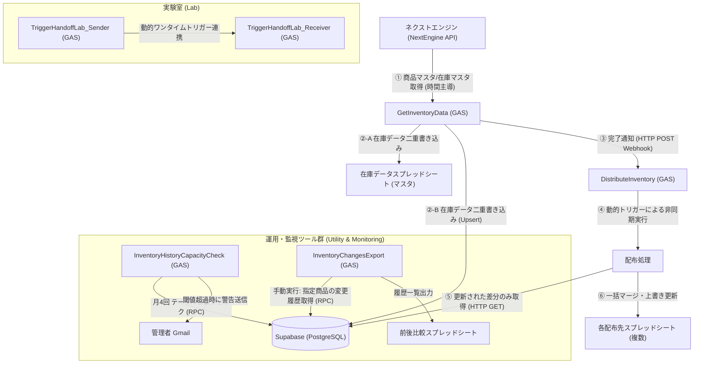

# Supabase 在庫管理連携システム (Project Group)

本リポジトリは、**ネクストエンジン（NextEngine）** から商品および在庫データを取得し、**Supabase（PostgreSQL）** をデータハブとして連携、複数の確認用スプレッドシートに対してデータ配布や履歴監視を行う Google Apps Script（GAS）および SQL スクリプトのプロジェクト群です。

各プロジェクトは目的別にフォルダ分割されており、個別の GAS プロジェクトとして構築されています。

---

## 1. システム全体アーキテクチャ ＆ データフロー

本プロジェクト群におけるデータおよび制御の連携関係は以下の通りです。



---

## 2. ディレクトリ構成とプロジェクト一覧

本リポジトリは以下のプロジェクトおよびディレクトリで構成されています。

| ディレクトリ / ファイル | プロジェクト区分 | 概要 | 詳細ドキュメント |
| :--- | :--- | :--- | :--- |
| [**`GetInventoryData/`**](./GetInventoryData) | GAS (主システム) | ネクストエンジンAPIから在庫情報を取得し、スプレッドシートおよびSupabaseへ二重書き込みを行う。完了後に `DistributeInventory` へWebhook通知を送信。 | [GetInventoryData README](./GetInventoryData/README.md) |
| [**`DistributeInventory/`**](./DistributeInventory) | GAS (主システム) | `GetInventoryData` からのWebhook契機で起動し、Supabaseの最新の更新差分を抽出して、指定された複数の社内確認用スプレッドシートに一括配布・上書き更新を行う。 | [DistributeInventory README](./DistributeInventory/README.md) |
| [**`InventoryChangesExport/`**](./InventoryChangesExport) | GAS (ツール) | 指定された商品コードの在庫変更履歴をSupabaseの履歴テーブル（`ne_inventory_history`）から抽出し、スプレッドシートにエクスポートする独立ツール。 | [InventoryChangesExport README](./InventoryChangesExport/README.md) |
| [**`InventoryHistoryCapacityCheck/`**](./InventoryHistoryCapacityCheck) | GAS (監視) | Supabaseの履歴テーブル物理容量を定期チェックし、閾値（80/90/100 MB）を超過した場合に管理者にGmail警告を送信するセーフティネット。 | [InventoryHistoryCapacityCheck README](./InventoryHistoryCapacityCheck/README.md) |
| [**`TriggerHandoffLab/`**](./TriggerHandoffLab) | GAS (検証) | GASの実行時間制限（30秒/6分）を回避するための「動的ワンタイムトリガーによる非同期ハンドオフ」を検証・学習するためのサンドボックス環境。 | [動的ワンタイムトリガー学習検証 指示書](./TriggerHandoffLab/TriggerHandoffLab_動的ワンタイムトリガー学習検証_指示書.md) |
| [**`sql/`**](./sql) | Database | Supabase側で定義するRPC（`get_inventory_changes` や `inventory_lag_check` など）やテーブル関連のSQLスクリプト群。 | - |
| [**`test/`**](./test) | GAS / SQL | スプレッドシート同期、Webhook手動テスト、リリースプロセス確認用などの検証・デバッグスクリプト群。 | - |
| [**`Supabaseのスリープ防止.gs`**](./Supabaseのスリープ防止.gs) | GAS (運用) | Supabaseの無料枠DBが一定期間アクティビティなしでスリープしてしまうのを防ぐため、定期的に軽微なクエリを実行するスクリプト。 | - |

---

## 3. 共通の開発方針 ＆ コーディングルール

本リポジトリのソースコードを変更・追加する際は、以下のルールを遵守してください。

### ① プロジェクトの分割方針
*   ネクストエンジンやSupabaseと接続するGASの開発は、**目的毎にフォルダを分けてプロジェクトを作成**します。
*   プロジェクト間は密結合にせず、Webhook (Web App URL) や Supabase DB を介して疎結合に連携させます。

### ② ファイル分割と設計ルール
各プロジェクト内は、役割ごとにファイルを細かく分割して見通しを確保します。
*   `10_Main.エントリーポイント.gs` : 外部トリガーや手動実行から最初に呼び出される関数を配置します。
*   `11_Config.設定管理.gs` : スクリプトプロパティのロードや環境変数の定義を管理します。
*   `12_Logger.ログ管理.gs` : ログ書き出しや管理者宛てメール通知などの共通ユーティリティを記述します。
*   `13_SupabaseClient.Supabase接続.gs` : SupabaseへのHTTPリクエスト発行（Fetch）などの低レイヤー接続ロジックを担当します。
*   その他、ビジネスロジックやデータ永続化（`SpreadsheetRepository` 等）に適切にファイルを分けます。
*   `99_Tests.テスト.gs` : 単体テストおよび統合テスト用の関数を配置します。

### ③ ヘッダーコメント of 関数
スクリプトの関数および主要モジュールには、その役割がひと目でわかるよう、**ヘッダーコメント（JSDoc形式）を入力**してください。
```javascript
/**
 * Supabaseから指定日時以降に更新された在庫の差分データを取得します。
 * @param {string} lastExecutedAt - 前回実行日時 (ISO 8601形式の文字列)
 * @return {Array<Object>} 変更のあった在庫レコードの配列
 */
function getChangedInventorySince(lastExecutedAt) {
  // ...
}
```

### ④ テスト関数の作成 ＆ テスト方法
新しい関数を追加したり、既存のロジックを変更したりする場合は、必ず **`99_Tests.テスト.gs`（または `xx_Test.gs`）にテスト関数を作成** してください。
*   **テスト関数の命名規則**: `test_` で始めるか、`test_` プレフィックスを付与します。
*   **アサーションログ**: テスト結果が「成功」か「失敗」かが実行ログ（またはスプレッドシート）で一読して判別できるように出力してください。
*   **テスト手順**:
    1. テストを実行する前に必要なスクリプトプロパティ（ダミーURLやキーなど）がテスト用環境に定義されていることを確認します。
    2. GASエディタの関数選択プルダウンから作成した `test_xxx` を選択して「実行」します。
    3. 実行ログで `[SUCCESS]` もしくは想定通りのアサーション結果が返ることを確認します。

---

## 4. デプロイ ＆ ローカル開発手順

各GASプロジェクトは、Google Apps Scriptエディタで直接編集するほか、`clasp`（Command Line Apps Script Projects）を利用したローカル開発・Git管理が推奨されます。

### claspを用いたデプロイ手順例
1. 各プロジェクトディレクトリで `clasp login` にて認証を行います。
2. 必要に応じて `.clasp.json` を適切に配置します。
3. ローカルで編集後、以下のコマンドでGAS側にアップロード（デプロイ）します。
   ```bash
   clasp push
   ```
4. Web Appとしての公開やバージョン管理は、GASエディタまたは `clasp deploy` にて行います。
